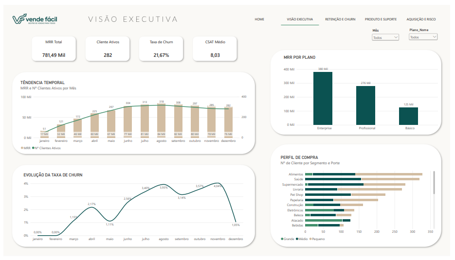
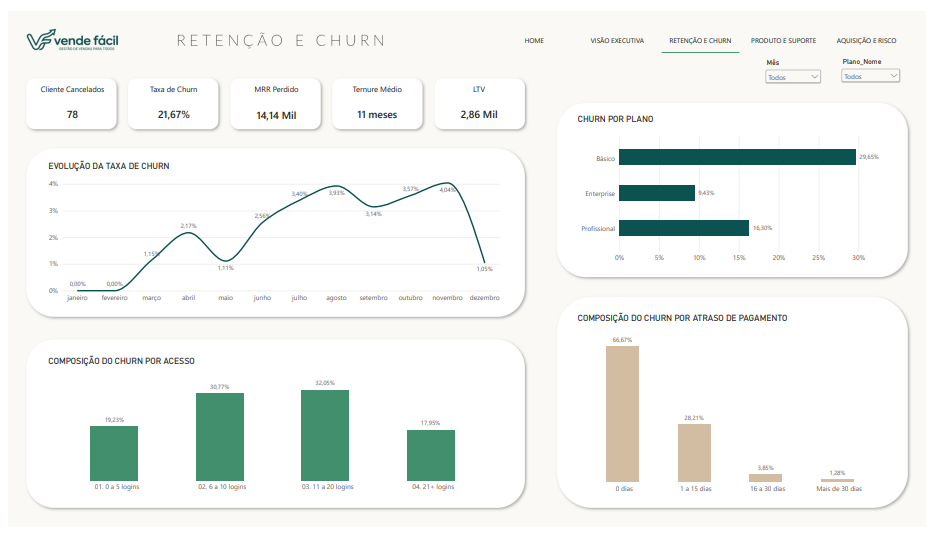
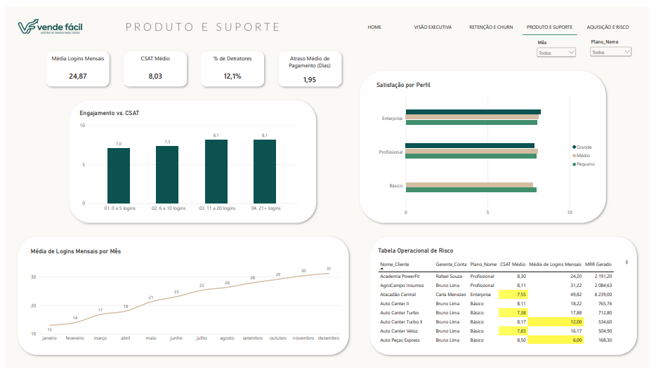
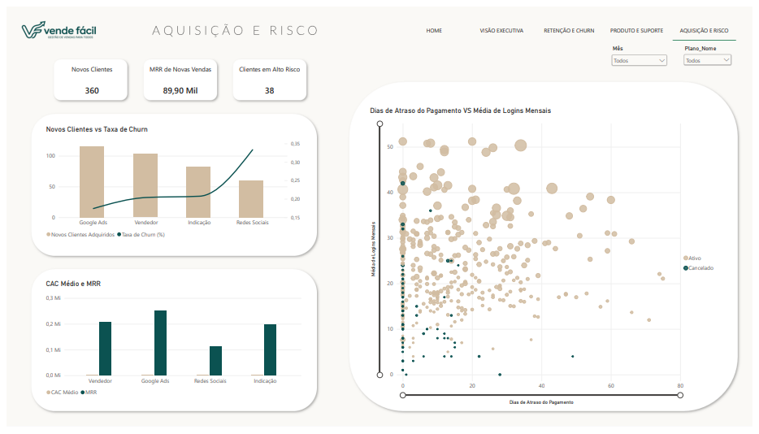

# Análise de Churn e Retenção de Clientes — VendeFácil


## 📌 O Problema de Negócio

A **VendeFácil** é uma SaaS B2B fictícia de e-commerce para pequenas e médias lojas. Em 2025, a empresa cresceu em aquisição até agosto, mas a partir de setembro a base estagnou e o MRR começou a recuar — a aquisição já não compensava o churn.

A diretoria precisava entender **quais sinais de uso, atraso de pagamento e satisfação estavam mais associados ao cancelamento** de clientes.

## 🎯 Objetivo

Identificar os principais preditores de churn e propor um plano de ação para reduzir a taxa de cancelamento de **21,67% para 14% em 6 meses**.

## 🛠️ Ferramentas e Metodologia

| Etapa | Ferramenta | Descrição |
|---|---|---|
| Tratamento | Excel + Power Query | Padronização, colunas derivadas e flag de churn |
| Modelagem | Power BI | Star schema: `fato_vendas` + 4 dimensões (cliente, plano, canal, calendário) |
| Métricas | DAX | 15 medidas de negócio (MRR, Churn, LTV, Tenure, CSAT, entre outras) |
| Visualização | Power BI | Dashboard executivo com 4 páginas |
| IA no Produto | FastAPI + Gemini/OpenAI + SQLite | Agente Text-to-SQL que converte perguntas em português para SQL auditável |

## 📊 Principais Insights

1. **Engajamento é chave** — Clientes com **6 a 20 logins/mês** concentram **62,82%** dos cancelamentos. Baixo uso é o maior preditor de churn. A correlação entre logins e MRR é de 0,51.
2. **Atraso de pagamento** — Clientes cancelados atrasam **2,2x mais** (4,19 dias vs 1,89 dias dos ativos). A faixa de 1 a 15 dias concentra 28,21% dos cancelamentos.
3. **Plano Básico** — Concentra a maior taxa de churn (**29,65%**), **3x maior** que o Enterprise (9,43%), sugerindo falha no onboarding do plano de entrada.
4. **Canal de Aquisição** — Clientes vindos de **Redes Sociais** têm a maior taxa de churn (**32%**), indicando desalinhamento entre expectativa da campanha e experiência real.

## 📈 Resultados e Impacto

- **360 clientes** e **3.021 registros** de cliente/mês analisados (jan–dez/2025).
- **MRR total de R$ 781,49 mil** no ano; **R$ 76,3 mil** no último mês.
- **CSAT médio de 8,03**.
- **Meta**: redução de churn para **14%**, com retenção projetada de **~14 clientes/semestre** e **+R$ 30 mil/ano em MRR retido**.
- **38 clientes prioritários** identificados por interseção de sinais de risco (baixo uso + atraso + CSAT baixo).
- **Agente VendeFácil** (Text-to-SQL): consulta em linguagem natural sobre a base, com SQL 100% auditável e executado em modo somente leitura.

## 🤖 O Agente VendeFácil (Text-to-SQL)

Ferramenta criada para democratizar o acesso aos dados pela liderança, sem depender de analistas.

**Arquitetura:** FastAPI (backend) + Gemini (LLM principal) + OpenAI (fallback) + SQLite (execução em modo somente leitura).

**Exemplos de perguntas suportadas:**
- "Quantos clientes ativos existem atualmente?"
- "Compare o atraso médio entre ativos e cancelados."
- "Qual canal de aquisição tem mais clientes?"

Toda resposta exibe o SQL gerado, garantindo **auditabilidade total** do resultado.

## 📂 Estrutura do Repositório

```
vendefacil-analise-churn/
├── data/
│   ├── raw/              # dataset_vendefacil_saas_junior.xlsx
│   └── processes/        # dimensoes_star_schema_vendefacil.xlsx
├── powerbi/
│   └── vendefacil_dashboard.pbix
├── docs/
│   ├── Relatorio_Final_VendeFacil.pdf
│   └── roteiro_apresentacao.html
└── README.md
```


## 🖼️ Visão do Dashboard

### Visão Executiva

*KPIs de contexto e tendência temporal do MRR e base de clientes ao longo de 2025.*

### Retenção e Churn

*Análise dos principais preditores de cancelamento: uso, plano, atraso de pagamento e LTV.*

### Produto

*Correlação entre engajamento, satisfação e risco, com tabela operacional de clientes prioritários.*

### Aquisição e Risco

*Análise dos canais de aquisição, CAC, MRR e correlação entre engajamento e atraso de pagamento.*

## 🚀 Recomendações do Projeto

Plano de ação de 90 dias, com 5 frentes prioritárias:

1. **Onboarding segmentado por plano** — meta de 15 logins/mês nos primeiros 90 dias, foco no Básico.
2. **Régua de cobrança ativa** — gatilho automático no 5º dia de atraso.
3. **Programa de referral** — incentivo financeiro para ampliar o canal de menor risco.
4. **Realinhamento de ICP de Redes Sociais** — qualificação estrita das campanhas.
5. **Resgate ativo dos 38 clientes de altíssimo risco** — ação proativa imediata.

## 👥 Autores e Contribuições

Projeto desenvolvido em grupo na pós-graduação em **Análise de Dados e IA (CESAR School) — 2026**.

- **Fernanda Falchetto** 
- **Lucas Ramalho** 
- **Eduardo Jungmann** 
- **Bruno Passo** 
- **Josimar Torre** 
- **Marcelo Carvalho** 

## 📬 Contato

**Eduardo Jungmann** — [LinkedIn](https://www.linkedin.com/in/eduardo-jungmann-99ba85148) | [GitHub](https://github.com/duduans)
